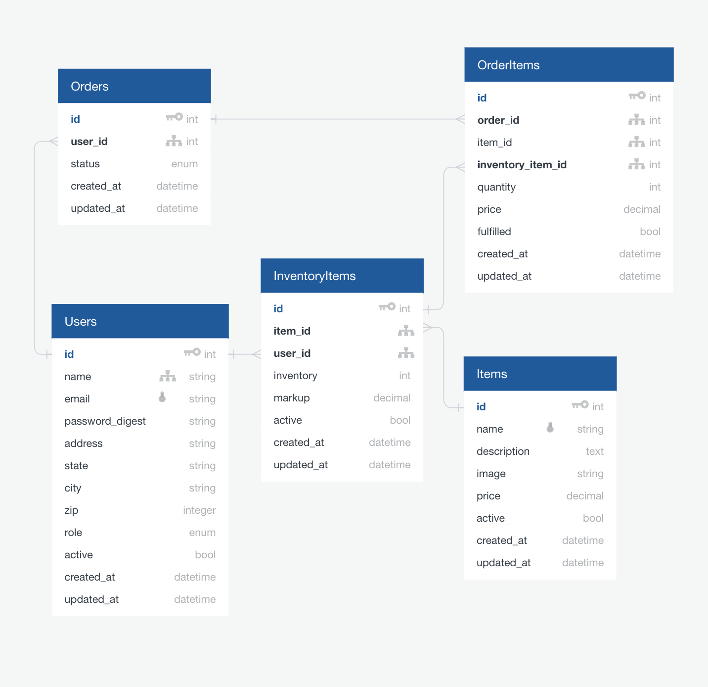

## Project Description
This is an extension of the Little Shop exercise from Turing School of Software and Design, Mod 2. The original project was a simplified version of an online marketplace in which users, merchants, and administrators could access their accounts and perform the actions relevant to their role.

In the original version, each 'Item' was owned by a single merchant, so merchants would have to duplicate items to sell the same thing as someone else. This extension allows all merchants sell all items, to adjust the base price of each item (much more liberty than they should have...), as well as to set their own markups to these base prices. See below for a more detailed description of the requirements.

## Requirements
### Many merchants can sell the exact same item (counts as 2 extension points)

Multiple merchants can sell the exact same item instead of duplicating the item in the system over and over.

Items will have a base cost which any merchant can modify, and merchants will have a "mark-up" fee that they can configure as part of their merchant profile data.

When a user views an item show page, they will see every merchant who sells that item. The item price displayed to the user will be both the base cost of the item plus each merchant's respective mark-up. For example, a user wants to buy a bottle of soda and its base cost is \$1. Merchant A has a mark-up of \$0.50 to all of their items, and Merchant B adds a mark-up of \$0.60 to all of their items. The user would see both merchant's prices on the page, and they will have an "add to cart" button next to each merchant, which puts that merchant's item into their cart.

When a user visits the item index page the prices they see will indicate how many merchants sell that item and show a range of prices like "Bottle of Soda, sold by 3 merchants, price range: \$1.25 to \$1.75"

#### Mod 2 Learning Goals reflected:

- MVC responsibilities
- Database relationships
- ActiveRecord
- Rails routing
- Software Testing

### Extra Stuff
These aren't required, but here are some other things I hope to implement if there's time:
- [ ] Merchants can add both absolute and relative markups. For example, as a merchant, I can mark up all items by $1.00 and/or by 20%.

- [ ] Merchants can add universal markups, which apply to every item they stock, but they can over-ride that markup on specific items.

## Execution
The first step is to update the original database schema to allow for the switch from a one-to-one relationship between Users (in a merchant role) and Items. This requires a join table (which I'm calling `InventoryItems` because it makes sense) and updating the existing rails relationships.

To implement the changes, we'll need a few database migrations as well.

## Revised Database Schema

